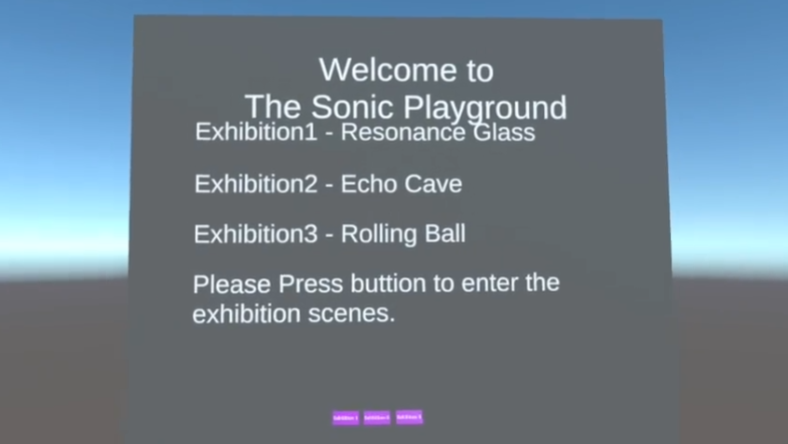
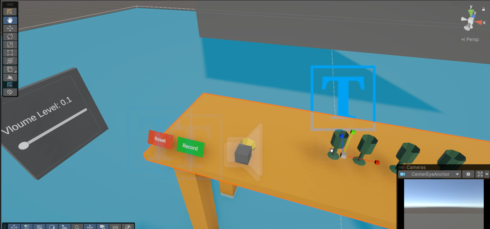
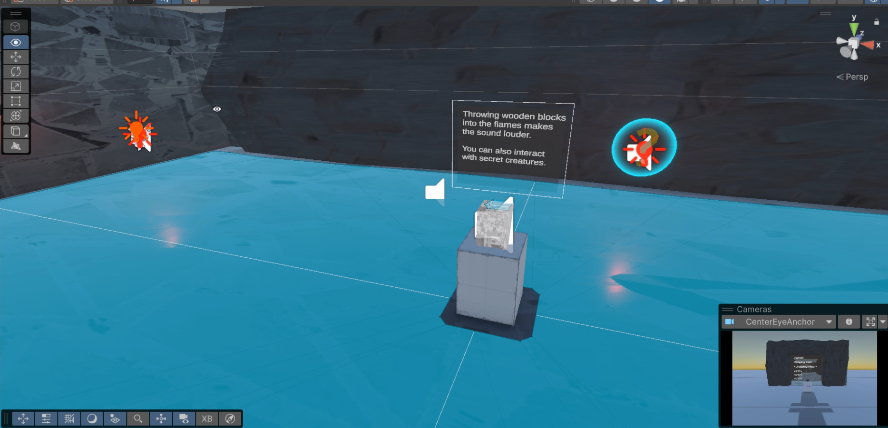
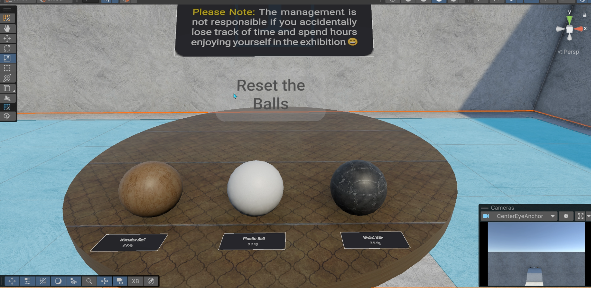

[English](README.md) | [中文](README_CN.md)

---

# Sonic Playground: 沉浸式音频设计项目

**项目负责人：** 刘逸飞、Pranavv Jothinathan、刘肃航、Skyler Sun  
**日期：** 2025年12月12日  
**平台：** VR (Meta Quest 3) / Unity

---

## 1. 项目概述
**Sonic Playground** 是一个交互式虚拟现实展览，旨在通过用户直接交互探索声音在物理空间中的行为。项目采用博物馆式布局，由三个相互关联的展区组成：**共振**、**洞穴声学** 和 **材料相关声音**。

体验设计为探索性与教育性并重，让用户将声音作为物理与空间现象进行互动，而非被动背景音频。

*注：本项目支持 Meta Quest 3 的手部追踪与控制器交互。*

---

## 2. 核心展区

### 🎤 展区一：共振
**概念** 探索物体在特定频率下如何振动。

**交互** 用户录制自己的声音，系统通过实时快速傅里叶变换（FFT）分析频率成分。

**反馈** 当用户的声音频率与虚拟酒杯的固有频率匹配时，酒杯会剧烈振动并最终碎裂。

### ⛰️ 展区二：洞穴声学
**概念** 展示露天与密闭环境的声学差异。

**体验** 用户从室外环境进入洞穴时，可通过脚步声与碰撞声即时感受混响、回声与反射的变化。

**技术** 使用 **Steam Audio** 插件实现 HRTF 空间化与遮挡，提供真实的尺度与纵深感知。

### 🔵 展区三：材料相关声音
**概念** 探究物理属性（质量、摩擦力、材质）如何影响声音的生成。

**交互** 用户可以抓取并滚动木质、塑料和金属球体，聆听不同的声学特征。

**实现** 根据物体的实时速度与碰撞强度，使用 `Mathf.Lerp` 动态调节音调与音量。

---

## 3. 技术栈
**引擎** Unity 6 (2023.3.0b8)

**音频空间化** Steam Audio 插件（HRTF 与物理声学）

**交互** XR Interaction Toolkit（支持手部追踪）

**核心算法** 
1. 实时 FFT 频率分析  
2. 基于速度的动态音高变换  
3. 物理材质集成

---

## 4. 资源与链接
* [📺 在 Bilibili 观看项目演示](https://www.bilibili.com/video/BV1KJFvz4ERD)
* [📄 下载详细设计文档 (PDF)](Immersive_Audio.pdf)

---
*© 2025 Sonic Playground 开发团队*
