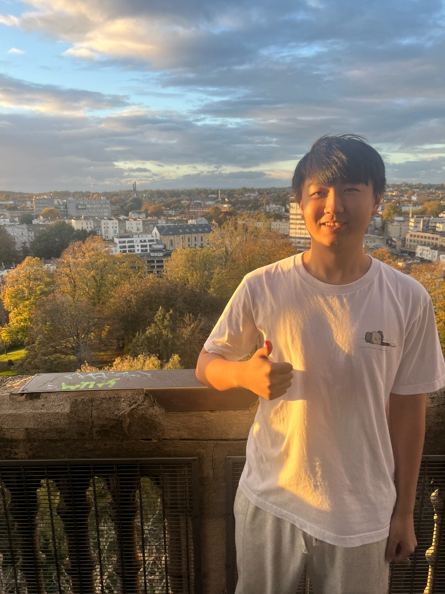

[English](README.md) | [中文](README_CN.md)

---

  

# 你好，我是刘逸飞 (Yifei Liu) 👋

> **布里斯托大学 沉浸式技术（虚拟和增强现实）硕士在读**

> **研究方向：XR 交互 | 深度学习 | 3D 世界模型**

我是一名研究者，致力于打造融合 **生成式 AI** 的 **XR系统**。我的工作主要关于 **计算机视觉**  **虚拟现实** 

---

## 🎓 教育背景

**布里斯托大学** | 沉浸式技术硕士 (VR/AR)  
*2025.09 - 至今*

**湖南大学** | 智能科学与技术 工学学士  
*2022.09 - 至今*  
*注：入选 **3+1 联合培养项目**，预计2026年获得双学位*

---

## 🧠 研究与技能

**核心方向** 面向 XR 的生成式 AI | 3维视觉

**学术背景**
* **Shape Lab（李瑞辉教授）：** 自大二起聚焦 3D 点云补全，作为沉浸式技术的基础方向
* **经典课程：** 机器学习、计算机视觉 (CS231n)、计算机图形学 (GAMES101/104)

**技术栈** PyTorch, Unity, Python, Meta XR SDK

---

## 🚀 代表项目

### Sonic Playground: VR 中的沉浸式空间音频
**2025.10 - 2025.12** | 在 Meta Quest 3 上开发的交互式 VR 展览，探索声学物理

* [项目代码 Code](https://github.com/Ronalfei17/Yifei-Personal-Page/tree/Sonic-Playground) · [演示视频 Demo Video](https://www.bilibili.com/video/BV1KJFvz4ERD)
* **交互：** 使用 Meta XR Interaction SDK 实现精准交互
* **声学：** 集成 **Steam Audio** 实现实时声音传播

---

## 🏆 体育

我曾是足球爱好者，并从重大 ACL 伤病中康复，这段经历塑造了我在科研压力下保持专注的韧性

* **亚军**，湖南大学足球杯

---

## 📫 联系我

| 平台 | 链接 |
| :--- | :--- |
| **Bilibili** | [Ronalfei 个人主页](https://space.bilibili.com/397202865) |
| **小红书** | [Ronalfei - 小红书](https://www.xiaohongshu.com/user/profile/62fe57a2000000000f006641) |
| **邮箱** | [zz24069@bristol.ac.uk](mailto:zz24069@bristol.ac.uk) |

---
> *"致力于定义 XR 的未来。"*
