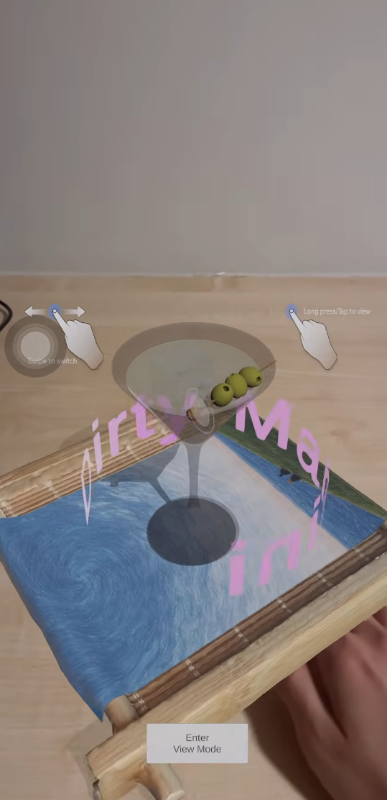
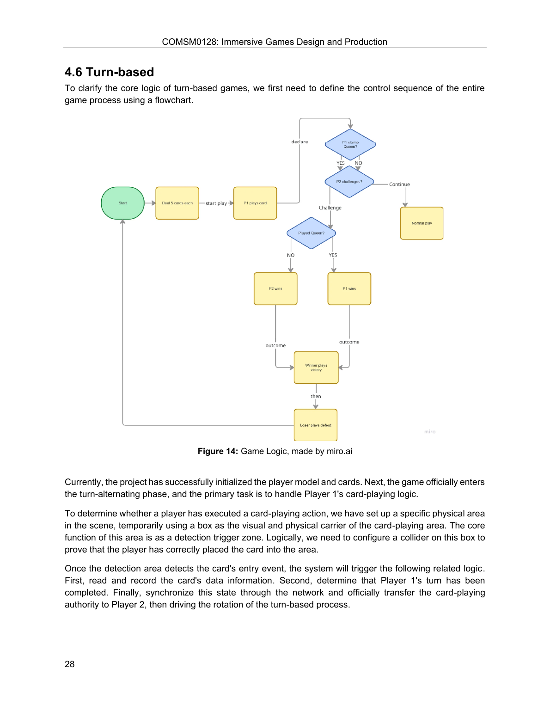
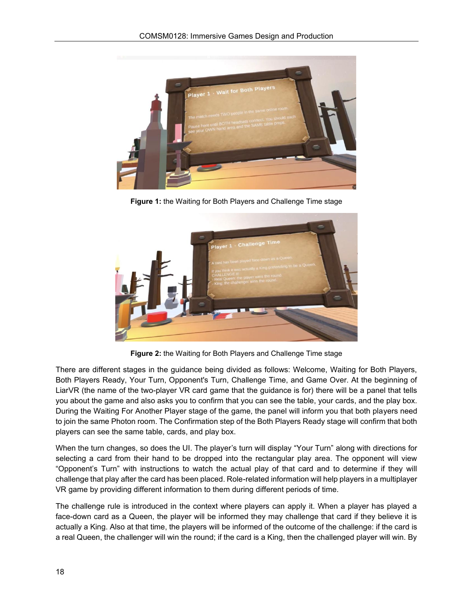
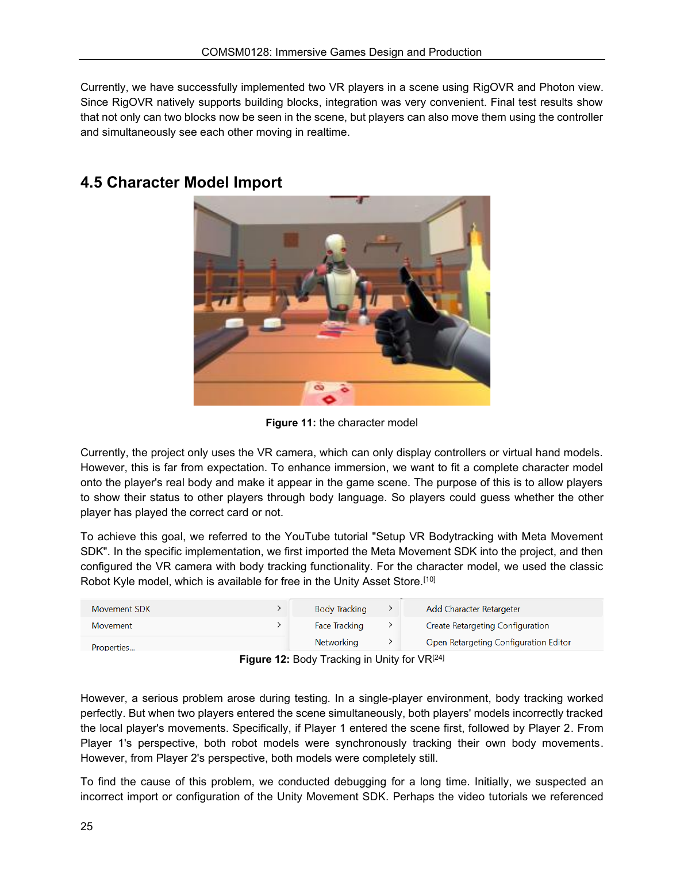
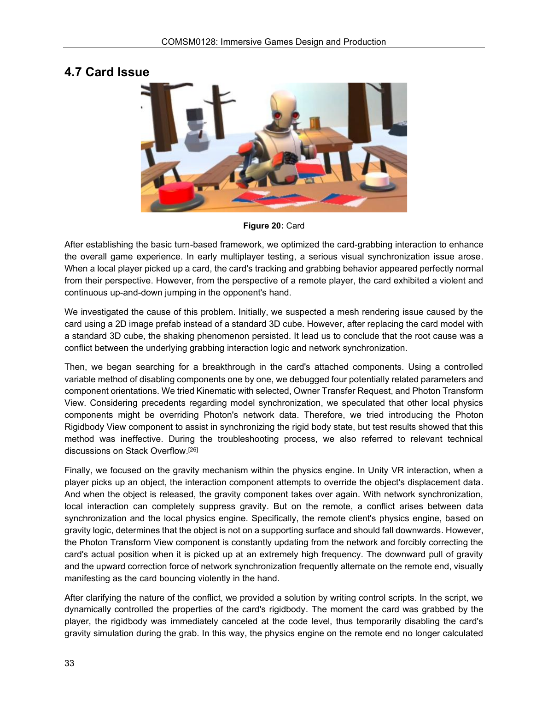
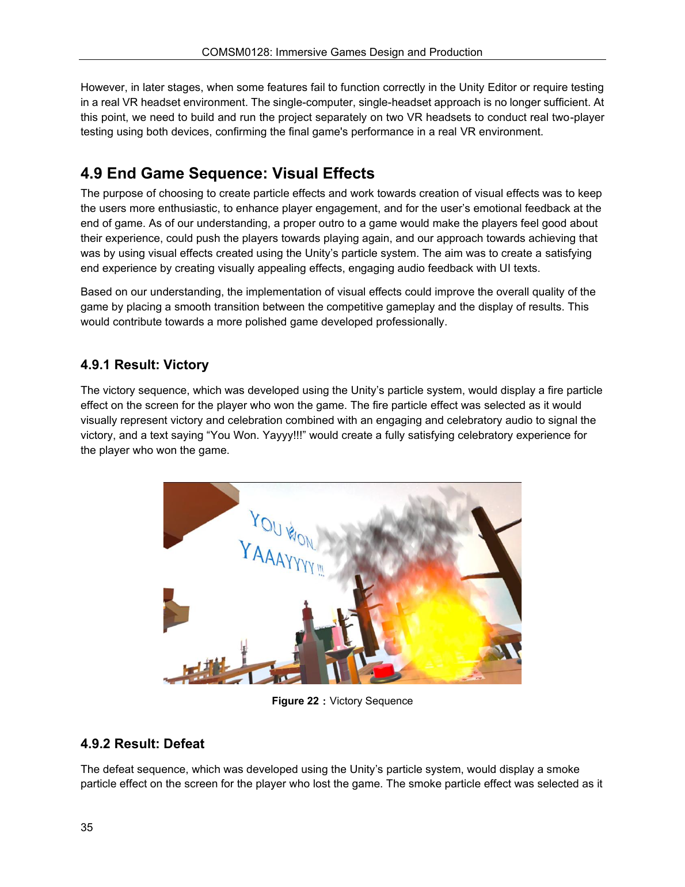
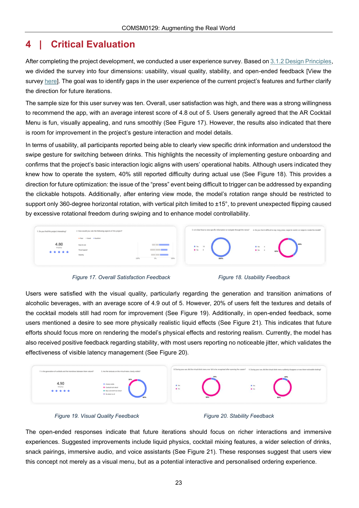

[English](README.md) | [中文](README_CN.md)

# LiarVR：多人 VR 欺骗卡牌游戏

**演示视频：** [点击观看](https://www.youtube.com/watch?v=oPDAqGpKcfY&t=17s)  
**详细报告：** [下载 PDF](LiarVR_Project_Report.pdf)  
**平台：** Meta Quest 3 / Unity / Photon PUN 2 / Meta XR  
**团队成员：** Pranavv Jothinathan、Yifei Liu、Lintao Guo

## 1. 项目概述

LiarVR 是一个双人 VR 欺骗类卡牌游戏，核心关注社交临场感、身体化交互和回合制多人同步。它不是把卡牌做成平面 UI，而是让两名玩家坐在同一个虚拟酒馆桌前，通过真实手部动作拿牌、出牌，并观察对方身体语言来判断是否 bluff。

这个项目探索的是：VR 如何让 social deduction 更具身体性。玩家不只是在看牌面状态，也会判断对方的动作、犹豫、节奏和出牌方式。

## 2. 我的主要贡献

- 调研和测试现有 VR 多人项目，并参与决定从零搭建一个更聚焦的原型。
- 使用 Photon PUN 2 搭建基础双人共享 VR 场景。
- 集成 VR camera 和真实身体追踪角色模型。
- 实现基于事件控制的回合制游戏逻辑。
- 实现卡牌初始化、卡牌交互、卡牌重置和 ownership 检查。
- 调试由 Unity 物理重力和 Photon 同步冲突导致的卡牌抖动问题。
- 测试多人稳定性、身体追踪对齐、challenge 逻辑和卡牌交互。

## 3. 游戏规则与流程

每名玩家开局拥有五张牌：三张 Queen 和两张 King。玩家在自己的回合把一张牌放进出牌盒，并声明自己出的是 Queen。对手可以选择继续出牌，也可以 challenge 上一张牌。如果被 challenge 的牌真的是 Queen，则被质疑的玩家获胜；如果是 King，则 challenge 的玩家获胜。玩家也可以通过成功打出全部五张牌获胜。

## 4. 核心功能

### 双人 VR 多人同步

项目使用 Photon PUN 2 创建双人共享场景。系统将本地 VR camera 与网络同步的玩家 prefab 分离：每台头显负责自己的本地视角和输入，Photon 负责同步玩家对象和游戏状态。

### 世界空间中的玩家引导

由于游戏同时包含进入房间、回合切换、实体卡牌操作、欺骗和 challenge 时机，新玩家容易迷惑。因此项目设计了一个基于游戏状态变化的 tutorial panel，并把它放在 world space 中，让 UI 看起来像 VR 场景的一部分，而不是普通屏幕浮层。

### 身体化角色与 Body Tracking

为了让 bluffing 更可观察，原型使用 Meta Movement SDK 驱动角色模型，而不是只显示控制器或手部模型。这样玩家可以通过对方的身体姿态和动作节奏进行判断。

### 回合制卡牌逻辑

回合逻辑通过 MasterClient 统一处理。出牌请求和 challenge 请求都先由 MasterClient 验证，再同步给所有客户端，从而保证两名玩家看到一致的回合状态、卡牌结果和胜负反馈。

### 卡牌交互调试

项目中一个关键技术问题来自 VR grab physics 和 Photon network updates 的冲突：本地玩家抓牌正常，但远端玩家看到卡牌剧烈抖动。团队通过逐个禁用组件定位问题，最终发现是物理重力和网络同步互相抢控制权，并据此调整卡牌同步逻辑。

### 游戏结束反馈

胜负状态通过音效、UI 文字和 Unity Particle System 强化。胜利玩家会看到火焰庆祝效果，失败玩家会看到烟雾反馈效果，让一局游戏有更完整的收尾。

## 5. 技术栈

- Unity
- Meta Quest 3
- Meta XR All-in-One SDK
- Meta Movement SDK
- Photon PUN 2
- Photon View
- Photon Transform View
- Unity physics triggers
- Unity Particle System

## 6. 评估与未来工作

用户研究显示，视觉与空间临场感是原型的相对优势，而界面稳定性和舒适度是最需要改进的部分。开放反馈也提到了手部抓牌、声音、延迟、眩晕，以及希望有更丰富的多人互动。

后续可以继续提升同步稳定性，减少 VR 不适，增加更清晰的回合与 challenge 反馈，优化卡牌触觉和动画，并进一步让身体语言或生理信号真正参与 bluffing 判断。

## 7. 资源

- [演示视频](https://www.youtube.com/watch?v=oPDAqGpKcfY&t=17s)
- [详细技术报告](LiarVR_Project_Report.pdf)
- [图片放置指南](Images/IMAGE_GUIDE.md)
