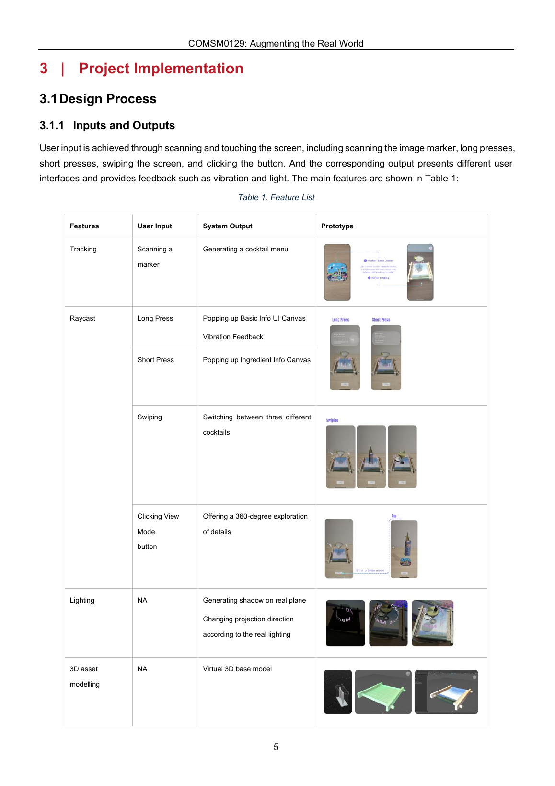
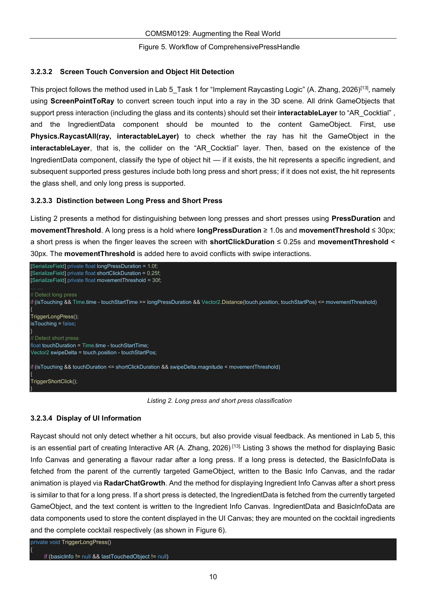
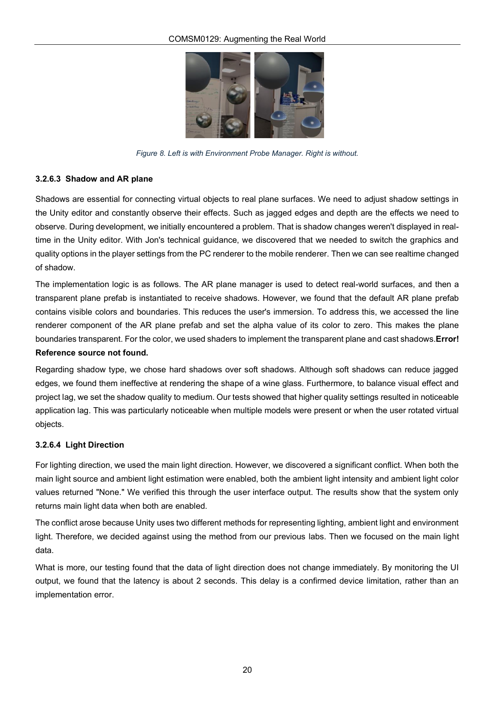
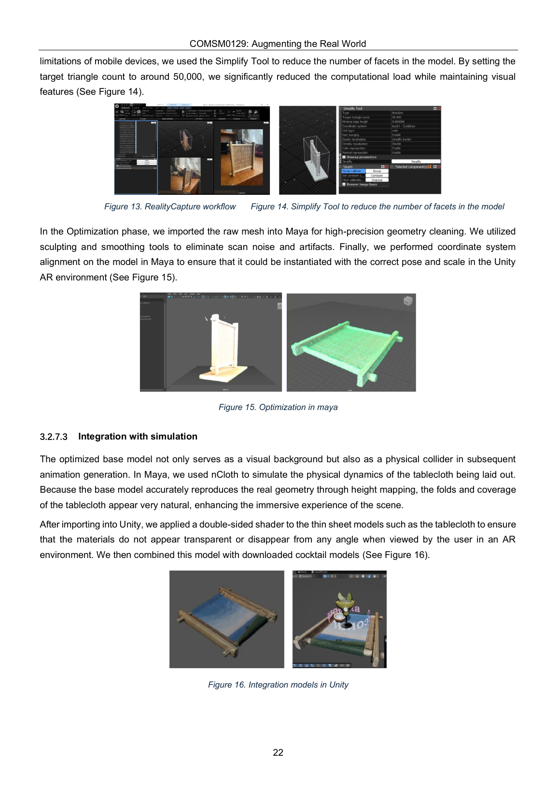

[English](README.md) | [中文](README_CN.md)

# AR Cocktail Menu：增强现实鸡尾酒菜单

**演示视频：** [点击观看](https://www.youtube.com/shorts/217OUgr1wzI)  
**详细报告：** [下载 PDF](AR_Cocktail_Report.pdf)  
**平台：** Unity / AR Foundation / Mobile AR  
**团队成员：** Pranavv Jothinathan、Zhihan Yu、Yifei Liu、Skyler Sun

## 1. 项目概述

AR Cocktail Menu 是一个移动端增强现实点单原型，目标是把传统的文字鸡尾酒菜单转化为可交互的 3D 产品展示。用户扫描实体杯垫标记后，系统会把虚拟鸡尾酒菜单稳定地锚定在真实桌面上，并支持通过触摸、滑动和 360 度查看模式了解不同饮品。

这个项目的重点不是简单把模型放到屏幕上，而是让虚拟饮品更自然地融入真实环境：包括稳定的图像追踪、清晰的手势交互、动态光照、环境反射、实时阴影和经过优化的 3D 资产。

## 2. 交互流程

用户先扫描杯垫标记，等待虚拟菜单生成；随后可以左右滑动切换饮品，短按配料查看成分信息，长按鸡尾酒查看基础信息，也可以进入 View Mode 近距离旋转观察模型细节。

## 3. 核心功能

### 图像追踪与菜单生成动画

系统使用 AR Foundation 的图像追踪，把实体杯垫与虚拟菜单连接起来。为了减少大型 prefab 在首次识别后的等待和抖动，项目采用预实例化方案：先在 `Awake()` 中生成并隐藏菜单，等图像追踪稳定后再激活并绑定到 tracked image 上。

### 触摸信息交互

交互系统把屏幕触摸转换为 3D raycast。短按可以显示配料信息，长按可以显示鸡尾酒基础信息并触发震动反馈。项目还通过触摸时长和移动阈值区分短按、长按和滑动，减少手势误触。

### 滑动切换与 360 度查看模式

用户可以通过水平滑动切换三种鸡尾酒模型。View Mode 会暂时把当前饮品从 AR 菜单中分离出来，移动到相机前方，关闭普通滑动切换，让用户直接旋转模型进行近距离观察。

### 光照、阴影与反射

项目使用 AR Light Estimation、透明接影平面和 Environment Probes，让玻璃材质、阴影和亮度变化更接近真实环境。

### 3D 资产流程

团队探索了 photogrammetry、RealityCapture、Maya 优化、双面材质以及基于 Stencil Shader 的液体模拟。由于透明玻璃很难稳定重建，最终选择使用竹制底座模型，并将其优化后与鸡尾酒模型整合到 Unity 中。

## 4. 技术栈

- Unity
- AR Foundation
- ARTrackedImageManager
- ARImageSmoothFollow
- DOTween
- Physics raycasting
- Light Estimation API
- Environment Probe Manager
- RealityCapture
- Maya
- Stencil Shader experiments

## 5. 技术挑战与解决方案

- 追踪后的首帧延迟：通过预实例化菜单并在追踪成功后绑定，减少可见等待和抖动。
- 手势冲突：通过触摸时长和位移阈值区分长按、短按和滑动。
- AR 真实感：通过亮度映射、实时阴影、环境反射和材质调试提升虚实融合效果。
- 移动端性能：通过降低扫描模型面数，在视觉质量和性能之间取得平衡。

## 6. 评估与未来工作

用户调研显示，参与者对应用整体兴趣较高，也认可饮品生成动画和视觉表现。主要改进方向包括：扩大可点击区域、提升按压触发稳定性、优化模型贴图细节，以及加入更真实的液体动态效果。

后续可以继续提升追踪稳定性，限制 View Mode 的垂直旋转范围，增加更多饮品，并扩展到配餐推荐、语音助手或沉浸式音频点单体验。

## 7. 资源

- [演示视频](https://www.youtube.com/shorts/217OUgr1wzI)
- [详细技术报告](AR_Cocktail_Report.pdf)
- [图片放置指南](Images/IMAGE_GUIDE.md)
